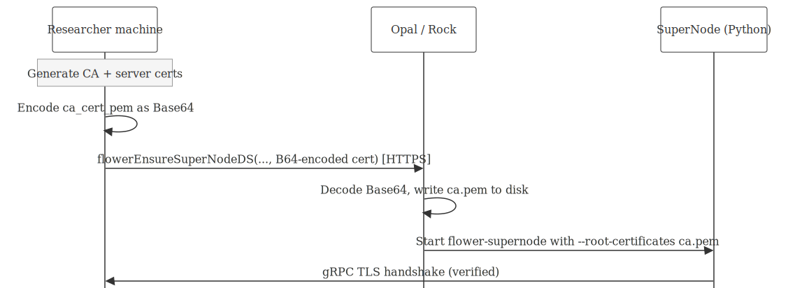

# Secure Connections: TLS Auto-Certificates

## Why TLS matters

The Flower gRPC channel between the SuperLink (your machine) and the
SuperNodes (Opal/Rock servers) carries model parameters, gradients, and
evaluation metrics. Without encryption, anyone on the network path
could:

- **Eavesdrop** on gradient updates (gradient inversion attacks can leak
  training data)
- **Redirect** a SuperNode to a rogue SuperLink that sends back a
  poisoned model
- **Tamper** with gradient updates in transit, degrading model quality

The DataSHIELD/Opal control channel is already HTTPS, but the Flower
gRPC training channel is separate. dsFlowerClient enforces TLS on this
channel: every call to
[`ds.flower.superlink.start()`](../reference/ds.flower.superlink.start.md)
auto-generates ephemeral certificates.

## How certificate generation works

dsFlowerClient generates ephemeral TLS certificates using the system
`openssl` CLI. Let’s see what it produces:

``` r

library(dsFlowerClient)

cert_dir <- tempfile("dsflower_certs_")
certs <- dsFlowerClient:::.generate_tls_certs(cert_dir)

cat("Generated files:\n")
#> Generated files:
for (f in list.files(cert_dir)) {
  sz <- file.size(file.path(cert_dir, f))
  cat(sprintf("  %-15s  %d bytes\n", f, sz))
}
#>   ca.key           302 bytes
#>   ca.pem           444 bytes
#>   ca.srl           17 bytes
#>   san.cnf          95 bytes
#>   server.csr       367 bytes
#>   server.key       302 bytes
#>   server.pem       542 bytes
```

Seven files. Let’s look at each important one.

### The CA certificate (root of trust)

``` r

ca_lines <- readLines(certs$ca_cert_path)
cat(paste(ca_lines, collapse = "\n"), "\n")
#> -----BEGIN CERTIFICATE-----
#> MIIBHDCBwgIJALM7yMnZLwDIMAoGCCqGSM49BAMCMBYxFDASBgNVBAMMC2RzRmxv
#> d2VyLUNBMB4XDTI2MDMxODA2NDAxOVoXDTI2MDMxOTA2NDAxOVowFjEUMBIGA1UE
#> AwwLZHNGbG93ZXItQ0EwWTATBgcqhkjOPQIBBggqhkjOPQMBBwNCAARP9hhZQacY
#> XpnxRzb+WP/wOgaFC4svGgM6waR0VQ2nuS99+YpGQxkpXg9crlEj/pPTTtZL3ZIS
#> iJoUVJ5nYjdeMAoGCCqGSM49BAMCA0kAMEYCIQCCLpV8m+LAQHDr1iFYSx+lj0Z/
#> qJt5mUHA0bAKG7eZlwIhAL9ClyaN78KsUyu9vpHh62e8EGoUO+25gvlWbUNcYDgO
#> -----END CERTIFICATE-----
```

This CA certificate gets distributed to every Opal. The CA private key
(`ca.key`) never leaves your machine:

``` r

cat("CA key permissions:", format(file.info(certs$ca_key_path)$mode), "\n")
#> CA key permissions: 600
cat("(0600 = owner read/write only)\n")
#> (0600 = owner read/write only)
```

### The SAN configuration

Subject Alternative Names determine which hostnames/IPs the server
certificate is valid for:

``` r

cat(readLines(file.path(cert_dir, "san.cnf")), sep = "\n")
#> [v3_req]
#> subjectAltName = DNS:localhost,DNS:host.docker.internal,IP:127.0.0.1,IP:192.168.1.89
```

| SAN                        | Purpose                        |
|:---------------------------|:-------------------------------|
| `DNS:localhost`            | SuperNode on the same machine  |
| `DNS:host.docker.internal` | SuperNode inside Docker        |
| `IP:127.0.0.1`             | Loopback connections           |
| `IP:<LAN IP>`              | SuperNode on the local network |

### The server certificate

``` r

srv_lines <- readLines(certs$srv_cert_path)
cat(paste(srv_lines, collapse = "\n"), "\n")
#> -----BEGIN CERTIFICATE-----
#> MIIBYzCCAQmgAwIBAgIJAJ1Nekd88VsJMAkGByqGSM49BAEwFjEUMBIGA1UEAwwL
#> ZHNGbG93ZXItQ0EwHhcNMjYwMzE4MDY0MDE5WhcNMjYwMzE5MDY0MDE5WjAdMRsw
#> GQYDVQQDDBJkc0Zsb3dlci1TdXBlckxpbmswWTATBgcqhkjOPQIBBggqhkjOPQMB
#> BwNCAATS6eUgPw0u23rUb2MfB81RVnmULkmr9+NuIxzJXwPzUFwNWwHyxu0tdGaU
#> vJUo0Mdf1dRFmudsXhbZy817m2ZwozowODA2BgNVHREELzAtgglsb2NhbGhvc3SC
#> FGhvc3QuZG9ja2VyLmludGVybmFshwR/AAABhwTAqAFZMAkGByqGSM49BAEDSQAw
#> RgIhAO24QblzPBLaW24qC0SI0ve6WUipJzTXHGv+jgynb0WIAiEA0AN8xyLo/68X
#> A3zSF3xQRKTcAArUsocB5Y9exLbe7Hs=
#> -----END CERTIFICATE-----
```

This is what the SuperLink presents during the TLS handshake. SuperNodes
verify it against the CA certificate.

### The generation sequence

All seven steps take roughly 5 milliseconds total (EC P-256 is fast):

    1. Sys.which("openssl")          -> find the binary
    2. ecparam -name prime256v1      -> probe EC support
    3. Write san.cnf                 -> SAN configuration
    4. ecparam -genkey + req -x509   -> CA key + self-signed cert (1-day expiry)
    5. ecparam -genkey + req + x509  -> server key + CSR + sign with CA
    6. Sys.chmod("ca.key", "0600")   -> restrict permissions
    7. readLines("ca.pem")           -> load PEM for distribution

We use `-extfile san.cnf` for SANs instead of `-addext` for
compatibility with both OpenSSL and LibreSSL (the default on macOS).

``` r

cat("OpenSSL version:", system2("openssl", "version", stdout = TRUE), "\n")
#> OpenSSL version: LibreSSL 3.3.6
```

## Live demo: TLS-encrypted training across 3 sites

Let’s connect to three real Opal servers and run federated training with
TLS encryption on the gRPC channel.

``` r

library(DSI)
library(DSOpal)

builder <- DSI::newDSLoginBuilder()
builder$append(server = "site_a", url = "https://localhost:8443",
               user = "administrator", password = "admin123",
               driver = "OpalDriver",
               options = "list(ssl_verifyhost=0, ssl_verifypeer=0)")
builder$append(server = "site_b", url = "https://localhost:8444",
               user = "administrator", password = "admin123",
               driver = "OpalDriver",
               options = "list(ssl_verifyhost=0, ssl_verifypeer=0)")
builder$append(server = "site_c", url = "https://localhost:8445",
               user = "administrator", password = "admin123",
               driver = "OpalDriver",
               options = "list(ssl_verifyhost=0, ssl_verifypeer=0)")

conns <- DSI::datashield.login(logins = builder$build(), assign = FALSE)
#> 
#> Logging into the collaborating servers
cat("Connected to:", paste(names(conns), collapse = ", "), "\n")
#> Connected to: site_a, site_b, site_c
```

``` r

quiet(ds.flower.nodes.init(conns, resource = "dsflower_test.flower_node"))
quiet(ds.flower.nodes.prepare(conns, target_column = "target",
                               feature_columns = c("f1", "f2", "f3", "f4", "f5")))

quiet(ds.flower.superlink.start())
Sys.sleep(2)
status <- ds.flower.superlink.status()
cat(sprintf("SuperLink running:   %s\n", status$running))
#> SuperLink running:   TRUE
cat(sprintf("  TLS cert:          %s\n",
    ifelse(is.null(status$ca_cert_pem), "none",
           paste0(substr(status$ca_cert_pem, 1, 27), "... (",
                  nchar(status$ca_cert_pem), " chars)"))))
#>   TLS cert:          -----BEGIN CERTIFICATE-----... (443 chars)
cat(sprintf("  Federation ID:     %s\n", status$federation_id))
#>   Federation ID:     fl-ieexombeu7fd

quiet(ds.flower.nodes.ensure(conns, symbol = "flower"))
#> Warning: site_c cannot reach SuperLink at host.docker.internal:9092
#> (There are some DataSHIELD errors, list them with datashield.errors())
#> Warning: Some nodes failed connectivity check: site_c. Consider providing
#> per-node superlink_address for those nodes.
Sys.sleep(10)

recipe <- ds.flower.recipe(
  task     = ds.flower.task.classification(),
  model    = ds.flower.model.sklearn_logreg(C = 1.0),
  strategy = ds.flower.strategy.fedavg(
    min_fit_clients = 3L, min_available_clients = 3L),
  num_rounds      = 3L,
  target_column   = "target",
  feature_columns = c("f1", "f2", "f3", "f4", "f5")
)

cat("\nTraining (TLS encrypted, 3 sites, 3 rounds)...\n\n")
#> 
#> Training (TLS encrypted, 3 sites, 3 rounds)...
run <- ds.flower.run.start(recipe, verbose = TRUE)
#> Flower App configuration warnings in '/private/var/folders/tn/qg45ss_91k375mrb66zqhx_m0000gn/T/RtmpA689wa/dsflower_app/sklearn_logreg/pyproject.toml':
#> - Recommended property "description" missing in [project]
#> - Recommended property "license" missing in [project]
#> 🎊 Successfully started run 16387788166003670182
#> INFO :      Start `flwr-serverapp` process
#> 🎊 Successfully installed sklearn_logreg to /var/folders/tn/qg45ss_91k375mrb66zqhx_m0000gn/T/RtmpA689wa/dsflower_superlink/apps/dsflower.sklearn_logreg.0.1.0.9921d28d.
#> INFO :      Starting Flower ServerApp, config: num_rounds=3, no round_timeout
#> INFO :      
#> INFO :      [INIT]
#> INFO :      Requesting initial parameters from one random client
#> INFO :      Received initial parameters from one random client
#> INFO :      Starting evaluation of initial global parameters
#> INFO :      Evaluation returned no results (`None`)
#> INFO :      
#> INFO :      [ROUND 1]
#> INFO :      configure_fit: strategy sampled 3 clients (out of 3)
#> INFO :      aggregate_fit: received 3 results and 0 failures
#> WARNING :   No fit_metrics_aggregation_fn provided
#> INFO :      configure_evaluate: strategy sampled 3 clients (out of 3)
#> INFO :      aggregate_evaluate: received 3 results and 0 failures
#> WARNING :   No evaluate_metrics_aggregation_fn provided
#> INFO :      
#> INFO :      [ROUND 2]
#> INFO :      configure_fit: strategy sampled 3 clients (out of 3)
#> INFO :      aggregate_fit: received 3 results and 0 failures
#> INFO :      configure_evaluate: strategy sampled 3 clients (out of 3)
#> INFO :      aggregate_evaluate: received 3 results and 0 failures
#> INFO :      
#> INFO :      [ROUND 3]
#> INFO :      configure_fit: strategy sampled 3 clients (out of 3)
#> INFO :      aggregate_fit: received 3 results and 0 failures
#> INFO :      configure_evaluate: strategy sampled 3 clients (out of 3)
#> INFO :      aggregate_evaluate: received 3 results and 0 failures
#> INFO :      
#> INFO :      [SUMMARY]
#> INFO :      Run finished 3 round(s) in 57.21s
#> INFO :          History (loss, distributed):
#> INFO :              round 1: 0.14109970773484848
#> INFO :              round 2: 0.141031615676245
#> INFO :              round 3: 0.14103127456124406
#> INFO :      
#> INFO :
#> INFO :      Starting logstream for run_id `16387788166003670182`
cat(sprintf("\nExit status: %s\n", run$status))
#> 
#> Exit status: 0

quiet(ds.flower.nodes.cleanup(conns, symbol = "flower"))
quiet(ds.flower.superlink.stop())
```

All gRPC traffic (model weights, gradients, evaluation metrics) was
encrypted in transit. TLS is transparent to the training protocol.

## How the CA cert reaches the Opals

The CA certificate travels through the DataSHIELD HTTPS channel (which
is already secure). Here is the encoding chain:



TLS certificate distribution flow

## Certificate lifecycle

| Event               | What happens                                     |
|:--------------------|:-------------------------------------------------|
| `superlink.start()` | Certs generated in temp dir (~5ms)               |
| `nodes.ensure()`    | CA public cert sent to each Opal via HTTPS       |
| SuperNode connects  | gRPC TLS handshake verifies server cert          |
| Training runs       | All gRPC traffic encrypted                       |
| `superlink.stop()`  | Entire temp dir deleted (certs included)         |
| 24 hours            | Certs expire (safety net if stop was not called) |

## Known limitations

- **No `extra_sans` in the public API**:
  [`.generate_tls_certs()`](../reference/dot-generate_tls_certs.md)
  accepts extra SANs but `superlink.start()` does not expose it yet.
- **No certificate renewal**: certs expire after 24 hours. Very long
  training runs may need manually generated certificates.
- **Opal method registration**: reinstalling dsFlower on Rock requires
  re-registering methods through Opal’s admin UI.
