```{r setup, include = FALSE}
knitr::opts_chunk$set(
  collapse = TRUE,
  comment = "#>",
  cache = TRUE
)
# Helper to suppress connection noise but show important output
quiet <- function(expr) invisible(capture.output(suppressMessages(expr)))
```

## The problem

You have patient data at three hospitals. You want to train a machine
learning model that learns from all three datasets, but you cannot move the
data out of each hospital. This is the standard federated learning setup,
and it is exactly what DataSHIELD was designed to enable for statistical
analysis.

dsFlower extends DataSHIELD to support federated *learning*, not just
federated *statistics*. It does this by bridging two systems: DataSHIELD
(which you already know) and Flower (a Python federated learning framework).

## Two packages, two roles

dsFlower is split into two R packages that run on different machines:


**dsFlowerClient** runs on *your* laptop. It is the orchestrator. You use
it to connect to servers, prepare data, start training, and collect results.

**dsFlower** runs on *each Opal/Rock server*. It receives instructions from
dsFlowerClient, manages the local training processes, and enforces the
server administrator's disclosure controls. You never interact with it
directly.

## Two communication channels

dsFlower uses *two completely separate network channels* at the same time:



The **control channel** (top) is standard DataSHIELD over HTTPS. The
**training channel** (bottom) is Flower's gRPC protocol. Why two channels?
Because DataSHIELD's request-response model does not support the continuous,
bidirectional communication that federated training needs.

## Building blocks: specification objects

Before connecting to any server, dsFlowerClient lets you compose an
experiment from four building blocks. These are plain R objects that
describe *what* should happen, without triggering any computation:

```{r spec-objects}
library(dsFlowerClient)

# What kind of problem?
task <- ds.flower.task.classification()
task
```

```{r model-spec}
# What model to train?
model <- ds.flower.model.sklearn_logreg(C = 1.0, max_iter = 200L)
model
```

```{r strategy-spec}
# How to aggregate updates from nodes?
strategy <- ds.flower.strategy.fedavg(
  fraction_fit          = 1.0,
  min_fit_clients       = 3L,
  min_available_clients = 3L
)
strategy
```

```{r privacy-spec}
# Any privacy enhancements?
privacy <- ds.flower.privacy.research()
privacy
```

Then you combine them into a recipe:

```{r recipe-create}
recipe <- ds.flower.recipe(
  task            = task,
  model           = model,
  strategy        = strategy,
  privacy         = privacy,
  num_rounds      = 5L,
  target_column   = "target",
  feature_columns = c("f1", "f2", "f3", "f4", "f5")
)
recipe
```

The recipe is just a specification. Nothing runs until you call
`ds.flower.run.start()`. See `vignette("experiment-recipes")` for all
available models, strategies, and privacy settings.

## Live demo: federated learning across 3 sites

Everything that follows runs against **three real Opal/Rock servers**
running in Docker. Each one holds a different partition of a synthetic
classification dataset (200 rows each, 5 features, binary target).

### Stage 1: Connect to the three Opal servers

```{r connect, cache = FALSE}
library(DSI)
library(DSOpal)

builder <- DSI::newDSLoginBuilder()
builder$append(server = "site_a", url = "https://localhost:8443",
               user = "administrator", password = "admin123",
               driver = "OpalDriver",
               options = "list(ssl_verifyhost=0, ssl_verifypeer=0)")
builder$append(server = "site_b", url = "https://localhost:8444",
               user = "administrator", password = "admin123",
               driver = "OpalDriver",
               options = "list(ssl_verifyhost=0, ssl_verifypeer=0)")
builder$append(server = "site_c", url = "https://localhost:8445",
               user = "administrator", password = "admin123",
               driver = "OpalDriver",
               options = "list(ssl_verifyhost=0, ssl_verifypeer=0)")

conns <- DSI::datashield.login(logins = builder$build(), assign = FALSE)
cat("Connected to:", paste(names(conns), collapse = ", "), "\n")
```

### Stage 2: Initialize and inspect capabilities

```{r init}
init_result <- ds.flower.nodes.init(
  conns, resource = "dsflower_test.flower_node", symbol = "flower"
)

# What does each site have?
caps <- DSI::datashield.aggregate(
  conns, expr = quote(flowerGetCapabilitiesDS("flower"))
)
for (srv in names(caps)) {
  cat(sprintf("  %s: %d rows x %d cols | Python %s | Flower %s | Docker: %s\n",
    srv, caps[[srv]]$data_n_rows, caps[[srv]]$data_n_cols,
    caps[[srv]]$python_version, caps[[srv]]$flower_version,
    caps[[srv]]$is_docker))
}
```

Each server reports its data shape, Python version, and Flower version.
The `is_docker = TRUE` flag tells dsFlowerClient to use
`host.docker.internal` as the SuperLink address (instead of the host's
LAN IP).

### Stage 3: Prepare training data

```{r prepare}
prep <- ds.flower.nodes.prepare(
  conns, symbol = "flower",
  target_column = "target",
  feature_columns = c("f1", "f2", "f3", "f4", "f5")
)
for (srv in names(prep$per_site)) {
  cat(sprintf("  %s: prepared = %s\n", srv, prep$per_site[[srv]]$prepared))
}
```

On each server, this validates the columns exist, checks the row count
against the disclosure threshold, and stages the data into a temporary
directory that the Python SuperNode will read.

### Stage 4: Start the SuperLink

```{r superlink}
quiet(ds.flower.superlink.start())
Sys.sleep(2)

status <- ds.flower.superlink.status()
cat(sprintf("SuperLink running:   %s\n", status$running))
cat(sprintf("  Fleet API:         %s\n", status$fleet_address))
cat(sprintf("  TLS certificate:   %s\n",
    ifelse(is.null(status$ca_cert_pem), "none",
           paste0(substr(status$ca_cert_pem, 1, 27), "... (",
                  nchar(status$ca_cert_pem), " chars)"))))
cat(sprintf("  Federation ID:     %s\n", status$federation_id))
```

The SuperLink runs on your machine with TLS enabled by default. It
auto-generates ephemeral certificates and listens on port 9092 for
SuperNode connections and on port 9093 for `flwr run` commands.

### Stage 5: Connect the three nodes

```{r ensure}
quiet(ensure <- ds.flower.nodes.ensure(conns, symbol = "flower"))
for (srv in names(ensure$per_site)) {
  cat(sprintf("  %s: node_ensured = %s\n", srv, ensure$per_site[[srv]]$node_ensured))
}
cat("\nWaiting for SuperNodes to register with SuperLink...\n")
Sys.sleep(10)
cat("Ready.\n")
```

Each Opal receives the SuperLink address and the TLS certificate,
verifies connectivity, and spawns a `flower-supernode` process that
connects to your SuperLink via encrypted gRPC.

### Stage 6: Train a model across 3 sites

```{r train}
recipe_lr <- ds.flower.recipe(
  task     = ds.flower.task.classification(),
  model    = ds.flower.model.sklearn_logreg(C = 1.0),
  strategy = ds.flower.strategy.fedavg(
    min_fit_clients = 3L,
    min_available_clients = 3L
  ),
  num_rounds      = 3L,
  target_column   = "target",
  feature_columns = c("f1", "f2", "f3", "f4", "f5")
)

cat("Training logistic regression across 3 sites (3 rounds)...\n\n")
run1 <- ds.flower.run.start(recipe_lr, verbose = TRUE)
cat(sprintf("\nRun completed with exit status: %s\n", run1$status))
```

That is real federated learning: the SuperLink coordinated 3 rounds of
training across 3 independent data sites. Each round, all 3 nodes trained
locally and sent their updated weights to the SuperLink, which averaged
them using FedAvg.

### Stage 7: Clean up

```{r cleanup, cache = FALSE}
quiet(ds.flower.nodes.cleanup(conns, symbol = "flower"))
quiet(ds.flower.superlink.stop())
cat("Cleaned up: staging data removed, SuperLink stopped.\n")
```

## Detailed explanation: what happens at each stage

### Under the hood: initialization

When `ds.flower.nodes.init()` runs on each server, Rock creates a "handle"
(a named list stored as the symbol `"flower"`):

```
handle = list(
  data_path    = "/data/train.csv",
  data_format  = "csv",
  python_path  = "python3",
  prepared     = FALSE,
  node_ensured = FALSE,
  ...
)
```

Every subsequent operation reads and modifies this handle. It tracks the
experiment lifecycle on that server.

### Under the hood: preparation

`ds.flower.nodes.prepare()` triggers several checks on the server before
any training:

1. **Schema check**: verifies all requested columns exist in the data
2. **Disclosure check**: ensures the dataset has enough rows (controlled by
   `nfilter.subset`, default 3)
3. **Staging**: creates a self-contained directory with `train_data.csv`
   and `manifest.json` (the Python SuperNode reads these)

### Under the hood: node connection

`ds.flower.nodes.ensure()` is the most complex step because it bridges the
two channels. It auto-detects whether each Opal runs in Docker (uses
`host.docker.internal`) or on bare metal (uses the researcher's LAN IP),
verifies TCP connectivity, and then spawns a `flower-supernode` process on
each server.

If auto-detection fails, you can provide addresses explicitly:

```{r ensure-explicit, eval = FALSE}
# Same address for all nodes
ds.flower.nodes.ensure(conns, superlink_address = "192.168.1.50:9092")

# Different address per node (e.g. different network segments)
ds.flower.nodes.ensure(conns, superlink_address = list(
  site_a = "10.0.1.100:9092",
  site_b = "10.0.2.100:9092",
  site_c = "10.0.3.100:9092"
))
```

### Under the hood: training

`ds.flower.run.start()` generates a Flower App from a Python template,
writes a `pyproject.toml` with all recipe parameters, and submits it via
`flwr run`. The SuperLink then coordinates the rounds: send global model
to all nodes, each node trains locally, send updates back, aggregate with
FedAvg, repeat.

## Server-side disclosure controls

The Opal administrator controls what experiments researchers can run:

| Control | Default | Effect |
|:--------|:--------|:-------|
| `nfilter.subset` | 3 | Minimum rows per node |
| `dsflower.max_rounds` | 500 | Maximum training rounds |
| `dsflower.allow_supernode_spawn` | TRUE | Can SuperNodes start? |
| `dsflower.max_concurrent_runs` | 5 | Simultaneous runs limit |
| `dsflower.allow_custom_config` | FALSE | Custom run configs? |

These are enforced during preparation, before any training starts.

## What's next

- `vignette("secure-connections")` details how TLS certificate generation
  works, step by step.
- `vignette("experiment-recipes")` shows all models, strategies, and
  privacy options, and how to compare experiments.

```{r final-cleanup, include = FALSE, cache = FALSE}
DSI::datashield.logout(conns)
```
